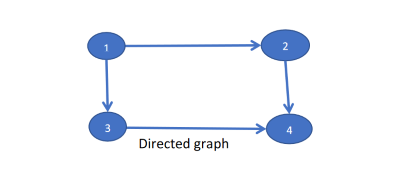
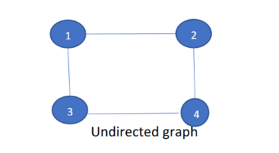
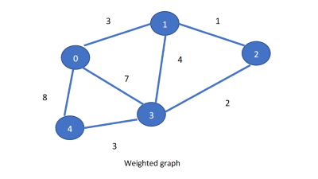

## Graphs

Graph G is a pair (V, E), where V is a finite set of vertices and E is a finite set of edges. We will often denote n = |V|, e = |E|. It consists of set of nodes and arcs.Each arch in a graph is specified by a pair of nodes.

### There are three types of graph:

- **Directed graph:** A graph G = (V, E) in which every edge is directed is called a directed graph.
Here, the edge <1, 2> is not the same as <2, 1>

    We have done the implementation of directed graph.

    

- **Undirected graph:** The graph G = (V, E) in which every edge is undirected.
Here, the edge <1, 2> is the same as <2, 1>

    
- **Weighted graph:** A weighted graph is a graph where each edge has
a numerical value called weight. It can be both directed or undirected.

    We will see its use in the Travelling Salesman problem.

    

### **Extra Python modules used:**
- **Numpy:** Numpy module was used for creation of the heap array

If Numpy module is not installed, make sure pip is installed, go to the terminal and type:

        pip install numpy

Image Courtesy: PESU Academy slides